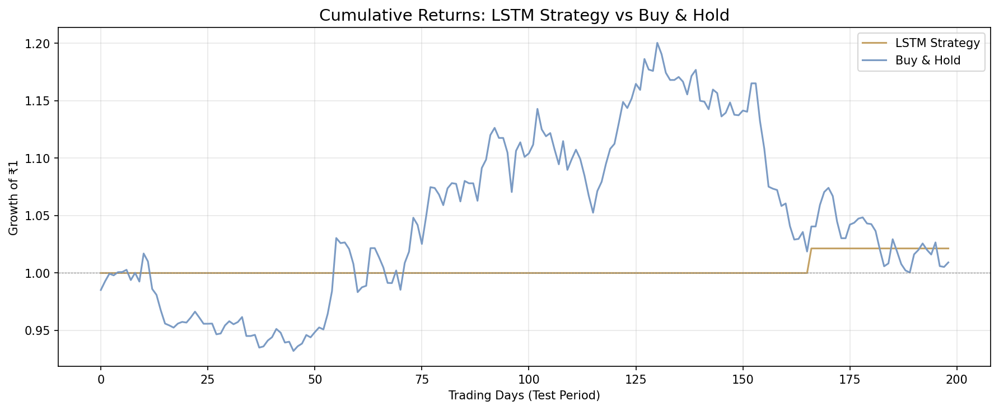
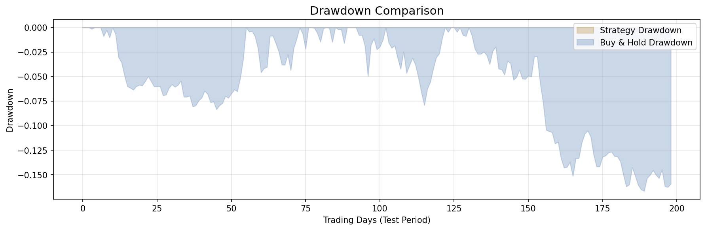

# Energy Stock Price Forecasting Using LSTM

Forecasting next-day closing prices of **NTPC** (National Thermal Power Corporation) — India's largest power utility — using LSTM neural networks, benchmarked against Linear Regression, Random Forest, and GRU baselines.

> **Key finding:** Linear Regression (RMSE 5.44) outperformed LSTM (RMSE 18.16) because the feature-target relationship is inherently linear — a strong lesson in matching model complexity to data structure.

---

## Results

| Model | RMSE (₹) | MAE (₹) | Directional Accuracy |
|-------|----------|---------|---------------------|
| **Linear Regression** | **5.44** | **4.06** | **51.74%** |
| LSTM (2-layer, 64 hidden) | 18.16 | 14.08 | 50.00% |
| GRU (2-layer, 64 hidden) | — | — | — |
| Random Forest (200 trees) | 24.85 | 22.30 | 49.57% |
| LSTM (Returns-based) | — | — | — |

*GRU and Returns-based LSTM results populate after running those scripts.*

### Why Linear Regression Won

The top features — SMA_50 (31.8%), SMA_200 (30.6%), EMA_12 (14.7%) — are smoothed versions of the closing price, making the feature→target relationship nearly perfectly linear. Linear Regression fits this exactly. Random Forest rounds predictions at tree-split boundaries, and LSTM overcomplicates what is fundamentally a linear mapping.

---

## Pipeline

```
Raw OHLCV Data → EDA & Analysis → Feature Engineering → Train/Val/Test Split → Model Training → Evaluation → Backtesting
```

### 1. Data Collection
- **Source:** Yahoo Finance via `yfinance`
- **Stock:** NTPC.NS (proxy for NIFTY Energy Index)
- **Period:** 5 years of daily OHLCV data (~1,250 trading days)

### 2. Exploratory Data Analysis
- Closing price trend, daily returns, 30-day rolling volatility
- Returns distribution with KDE overlay
- Monthly returns heatmap
- ACF/PACF autocorrelation plots
- ADF stationarity test (prices: non-stationary, returns: stationary)

<p align="center">
  
  
</p>
<p align="center">
  
  
</p>

### 3. Feature Engineering (17 Technical Indicators)

| Category | Features | Purpose |
|----------|----------|---------|
| Trend | SMA(20, 50, 200), EMA(12, 26), MACD | Market direction & momentum |
| Momentum | RSI(14), Stochastic K | Overbought/oversold detection |
| Volatility | Bollinger Bands (upper/lower), ATR | Price spread & range |
| Volume | OBV | Trend confirmation via volume |
| Custom | Returns(1d, 5d, 20d), Volume ratio, Price range | Multi-horizon returns |

### 4. Data Split

Chronological split (no shuffling — prevents data leakage):
- **Train:** 70% | **Validation:** 15% | **Test:** 15%
- StandardScaler fit on training set only

### 5. Models

**Linear Regression** — Simple baseline that exploits the linear feature-target relationship.

**Random Forest** (200 trees, max_depth=10) — Non-linear ensemble baseline.

**LSTM** — 2-layer LSTM with 64 hidden units, 30-day lookback window:
- Dropout (0.2 between LSTM layers, 0.1 before output)
- Adam optimizer with ReduceLROnPlateau scheduler
- Early stopping (patience=10) with gradient clipping (max_norm=1.0)
- Target scaling via separate StandardScaler (inverse-transformed for evaluation)

**GRU** — Same architecture as LSTM but with GRU cells (fewer parameters, faster training).

**LSTM (Returns)** — Predicts next-day *returns* instead of raw prices. Returns are stationary, so the LSTM should better capture temporal patterns.

<p align="center">
  
  
</p>
<p align="center">
  
</p>

### 6. Backtesting

Long-only trading strategy using LSTM predictions — buy when model predicts price will rise, hold cash otherwise. Compared against buy-and-hold benchmark.

Metrics: Sharpe ratio, max drawdown, cumulative return, win rate, market exposure.

<p align="center">
  
  
</p>

---

## Project Structure

```
energy-stock-forecasting/
├── data/
│   ├── ntpc_raw.csv                # Raw OHLCV data
│   └── ntpc_features.csv           # Processed features (17 indicators + target)
├── docs/
│   ├── 01_formal_project_proposal.pdf
│   ├── 02_my_rough_guide.pdf
│   ├── 03_reference_analysis_workbook.pdf
│   ├── 04_project_approval_form.pdf
│   ├── Certificate_of_Completion.pdf
│   └── Energy_Stock_Project_Report.pdf
├── plots/
│   ├── ntpc_closing_price.png      # Price trend
│   ├── ntpc_daily_returns.png      # Daily returns
│   ├── ntpc_volatility.png         # Rolling volatility
│   ├── returns_distribution.png    # Returns histogram + KDE
│   ├── monthly_heatmap.png         # Monthly returns heatmap
│   ├── acf_pacf.png                # ACF/PACF plots
│   ├── feature_importance.png      # RF feature importance
│   ├── training_curves.png         # LSTM train/val loss
│   ├── actual_vs_predicted.png     # LSTM predictions vs actual
│   ├── gru_training_curves.png     # GRU train/val loss
│   ├── gru_actual_vs_predicted.png # GRU predictions vs actual
│   ├── returns_lstm_training.png   # Returns-LSTM train/val loss
│   ├── returns_lstm_pred.png       # Returns-LSTM predictions
│   ├── backtest_cumulative.png     # Strategy vs buy-and-hold
│   └── backtest_drawdown.png       # Drawdown comparison
├── results/
│   ├── baseline_results.json       # LR + RF metrics
│   ├── all_model_results.json      # All models compared
│   ├── gru_results.json            # GRU metrics
│   ├── returns_lstm_results.json   # Returns-LSTM metrics
│   ├── backtest_results.json       # Backtest metrics
│   ├── lstm_predictions.npy        # LSTM test predictions
│   ├── gru_predictions.npy         # GRU test predictions
│   ├── test_actuals.npy            # Test set actual prices
│   └── test_close.npy              # Test set close prices
├── models/
│   ├── best_lstm.pth               # Saved LSTM weights
│   ├── best_gru.pth                # Saved GRU weights
│   └── best_lstm_returns.pth       # Saved returns-LSTM weights
├── downloaddata.py                 # Data collection script
├── exploredata.py                  # Initial EDA (price chart)
├── returns_analysis.py             # Returns & volatility analysis
├── eda_remaining.py                # Distribution, heatmap, ACF, ADF test
├── feature_engineering.py          # 17 technical indicators + target
├── baseline_models.py              # Linear Regression + Random Forest
├── lstm_model.py                   # LSTM training & evaluation
├── gru_model.py                    # GRU training & evaluation
├── predict_returns.py              # LSTM on returns (not prices)
├── backtesting.py                  # Strategy backtest vs buy-and-hold
├── requirements.txt                # Python dependencies (pinned)
├── .gitignore
└── README.md
```

---

## Setup

```bash
# Clone
git clone https://github.com/aariiparekh3012-collab/project1-aarya.git
cd project1-aarya

# Create virtual environment
python -m venv venv
venv\Scripts\activate        # Windows
# source venv/bin/activate   # macOS/Linux

# Install dependencies
pip install -r requirements.txt

# Run the full pipeline
python downloaddata.py          # Download NTPC data
python exploredata.py           # Closing price chart
python returns_analysis.py      # Returns & volatility
python eda_remaining.py         # Remaining EDA plots + ADF test
python feature_engineering.py   # Engineer 17 features
python baseline_models.py       # Train baselines
python lstm_model.py            # Train LSTM
python gru_model.py             # Train GRU
python predict_returns.py       # Train returns-based LSTM
python backtesting.py           # Backtest LSTM strategy
```

---

## Tech Stack

- **Data:** yfinance, pandas, NumPy
- **ML:** scikit-learn (Linear Regression, Random Forest, StandardScaler)
- **Deep Learning:** PyTorch (LSTM, GRU, DataLoader, LR scheduling)
- **Technical Indicators:** ta library
- **Visualization:** matplotlib, seaborn, statsmodels
- **Statistics:** ADF test, ACF/PACF, rolling volatility

---

## Key Learnings

1. **Simpler models can win.** When features have a linear relationship with the target, Linear Regression will beat complex models that spend capacity learning the same linear function plus noise.

2. **Data leakage is subtle.** Shuffling time-series data or fitting the scaler on the full dataset gives artificially good results that collapse in production.

3. **Target scaling matters for LSTMs.** Without scaling the target to match feature scale, the LSTM's gradients become unstable and predictions diverge.

4. **Feature importance reveals data structure.** The Random Forest importance plot showed that SMA/EMA features dominate — explaining why a linear model is the natural fit.

5. **Stationarity matters for model choice.** Returns are stationary (ADF p < 0.05) while prices are not — predicting returns gives LSTM a better shot at learning temporal patterns.

---

**Author:** Aarya Parekh | B.Tech Energy Engineering | IIT Bombay | August 2026
